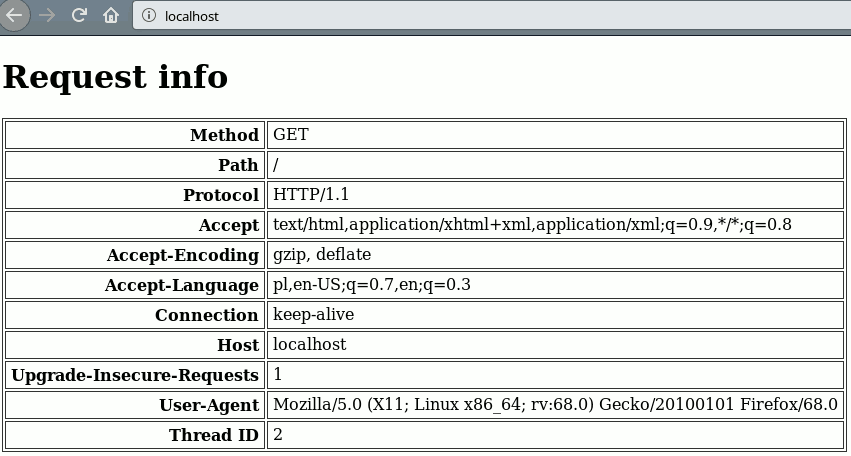

# Very Simple HTTP Server using Winsock

* Listens on port `80`
* Responds with received HTTP headers
* Sometimes crashes 😕




# How to build

## On Windows
Use provided Qt Creator project file.

## On Linux
It'd probably be easier to rewrite it to BSD sockets, but in current version it can be cross-compiled for Windows and then run with Wine:

```
$ i686-w64-mingw32-g++ *.cpp *.h -o server -static -static-libgcc -static-libstdc++ -lws2_32
$ sudo wine server.exe
```